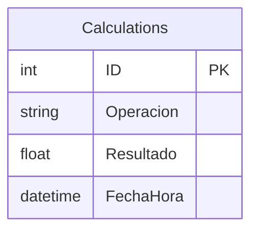
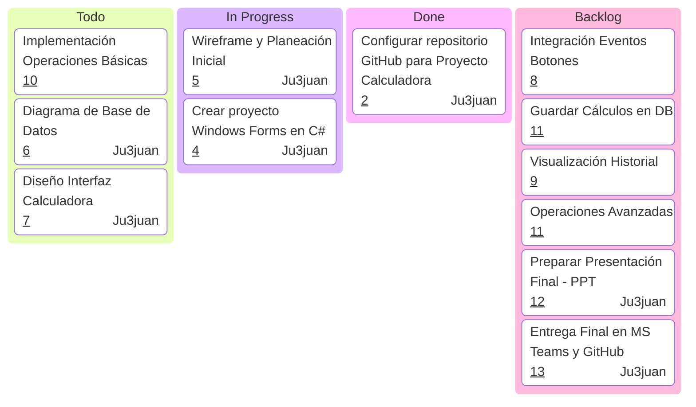
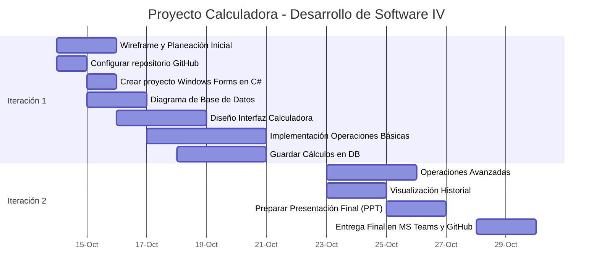
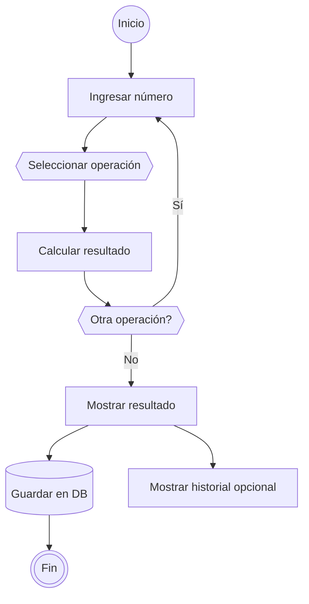

# Proyecto 1 - Calculadora

## Preview


## Resumen
Crear una **aplicación de calculadora en Windows Forms con C#** que permita a un usuario anónimo realizar cálculos básicos y algunos avanzados, registrando cada operación en una base 
de datos SQL Server.

## Requisitos Funcionales

1. **Usuario y acceso**
    - Usuario anónimo (sin login ni autenticación).
2. **Operaciones básicas**
    - Sumar, restar, multiplicar, dividir.
3. **Gestión de entradas**
    - Botones **C** (clear) y **CE** (clear entry) para borrar.
4. **Operaciones avanzadas**
    - Potencia al cuadrado (`x²`) y raíz cuadrada (`√x`).
    - Números negativos (botón `-`).
    - Números decimales (botón `.`).
5. **Persistencia de datos**
    - Guardar cada cálculo en una **tabla de MS SQL Server**.
    - Nombre de base de datos, tabla y campos definidos por el equipo.
6. **Opcionales**
    - Incorporar 2 operaciones adicionales (científicas o de desarrollador).
    - Botón **“Mostrar cálculos”** para listar operaciones guardadas en la base de datos.

## Base de datos


## Timeline




## Git Ignore

```gitignore
# Editors
**/.nvim/
**/.vs/
**/.vscode/

## Binary folders
**/Debug/
**/bin/
**/build/
**/packages/

# Compress files
*.zip
*.7z

# tmp
**/bin/
**/obj/
*.tmp

# unk
*.pdb
*.cache
*.log
.idea/
thumbs.db
.ds_store
*.user
*.suo
*.userosscache
*.sln.docstates
```


## Build

### Requerimientos (Windows) (Obligatorios)
- Visual Studio
- Sql Server

### Requerimientos (Windows) (Opcionales)
- SSMS Studio


## Git

### Config
```
git config --global core.autocrlf input
git config --global core.eol lf
```


### Git Pull
Always try 
```zsh
git pull --rebase
```

if you get a merge conflict, you can undo everything with 
```zsh
git rebase --abort
```

## Estructura del Proyecto - Github
### En Remote
```
Calculadora-cs/
│
├─ Properties/             # Archivos de configuración del proyecto
│   ├─ Resources.resx
│   └─ AssemblyInfo.cs
├─ App.config              # Configuración de la aplicación
├─ Form1.cs                # Lógica principal del formulario
├─ Form1.Designer.cs       # Diseño de la interfaz
├─ Form1.resx              # Recursos del formulario
├─ Program.cs              # Punto de entrada de la aplicación
├─ Calculadora123.csproj   # Archivo del proyecto C#
├─ .gitignore              # Ignorar bin, obj y archivos temporales
└─ Calculadora12.sln       # Solución de Visual Studio
```
## Botones

| Tipo    | Nombre                | Descripción                                             |
| ------- | --------------------- | ------------------------------------------------------- |
| TextBox | `txtDisplay`          | Pantalla principal donde se muestra el número/resultado |
| Button  | `btn0`                | Botón número 0                                          |
| Button  | `btn1`                | Botón número 1                                          |
| Button  | `btn2`                | Botón número 2                                          |
| Button  | `btn3`                | Botón número 3                                          |
| Button  | `btn4`                | Botón número 4                                          |
| Button  | `btn5`                | Botón número 5                                          |
| Button  | `btn6`                | Botón número 6                                          |
| Button  | `btn7`                | Botón número 7                                          |
| Button  | `btn8`                | Botón número 8                                          |
| Button  | `btn9`                | Botón número 9                                          |
| Button  | `btnSuma`             | Botón `+`                                               |
| Button  | `btnResta`            | Botón `-`                                               |
| Button  | `btnMultiplicar`      | Botón `*`                                               |
| Button  | `btnDividir`          | Botón `/`                                               |
| Button  | `btnC`                | Limpiar todo                                            |
| Button  | `btnCE`               | Limpiar entrada                                         |
| Button  | `btnPunto`            | Decimal `.`                                             |
| Button  | `btnNegativo`         | Cambiar signo `±`                                       |
| Button  | `btnCuadrado`         | Elevar al cuadrado                                      |
| Button  | `btnRaiz`             | Raíz cuadrada                                           |
| Button  | `btnMostrarHistorial` | Mostrar todos los cálculos guardados                    |

## Logic



# References

[Rivera, R. (2025). _DS4-Proyecto1-WinFormsApp_ [Documento PDF]. Universidad Tecnológica de Panamá.](https://utpac.sharepoint.com/sites/DSIV-1GS221-II2025/_layouts/15/embed.aspx)